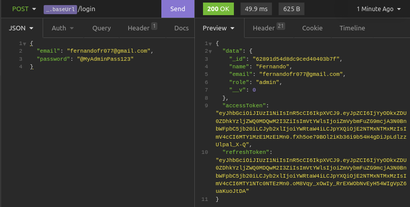
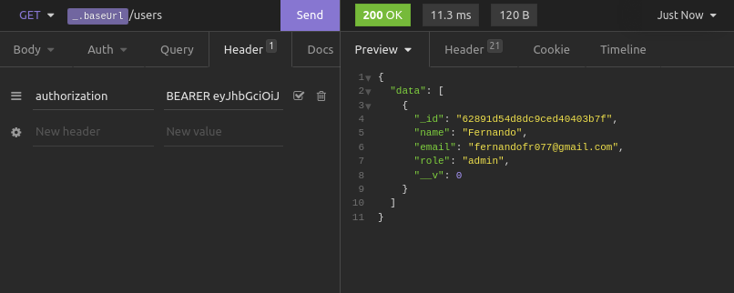
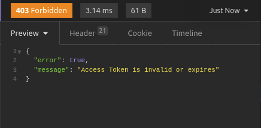

<h1>JWT Full Implementation</h1>

<h3>After Login you receive your Access and Refresh Token</h3>

<h3>Now, we can put your Access Token on auth headers</h3>

<h3>With a valid Access Token, privates routes are acessible</h3>

<h3>When Access Token expires, will throw a error</h3>

<h3>Using Refresh Token, we can get a new valid Access Token and a new Refresh Token, making the old one invalid (for security)</h3>
